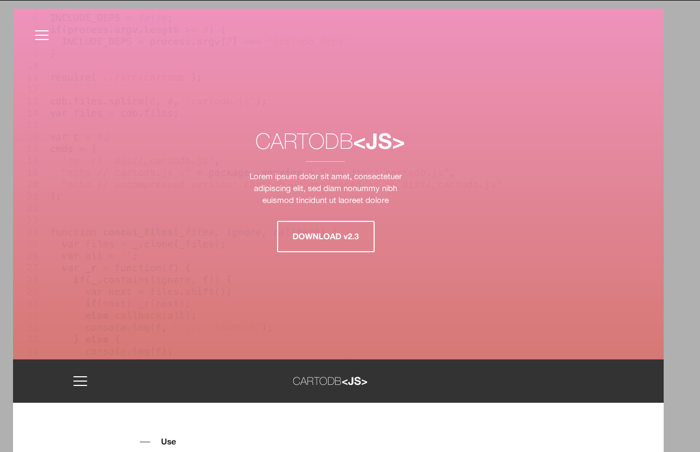

CartoDB.js (v3.11) [](https://travis-ci.org/CartoDB/cartodb.js)
===========

This library allows to embed you visualizations created with CartoDB in your map or website in a simple way.

[](http://cartodb.github.io/cartodb.js/)


## Quick start
============

  1. Add cartodb.js and css to your site:

    ```html

        <link rel="stylesheet" href="http://libs.cartocdn.com/cartodb.js/v3/3.11/themes/css/cartodb.css" />
        <script src="http://libs.cartocdn.com/cartodb.js/v3/3.11/cartodb.js"></script>

        <!-- use these cartodb.css links if you are using https -->
        <!--link rel="stylesheet" href="https://cartodb-libs.global.ssl.fastly.net/cartodb.js/v3/3.11/themes/css/cartodb.css" /-->

        <!-- use this cartodb.js link if you are using https -->
        <!-- script src="https://cartodb-libs.global.ssl.fastly.net/cartodb.js/v3/3.11/cartodb.js"></script -->
    ```


  2. Create the map and add the layer 
  
    ```javascript
      var map = L.map('map').setView([0, 0], 3);

      // set a base layer 
      L.tileLayer('http://a.tile.stamen.com/toner/{z}/{x}/{y}.png', {
        attribution: 'stamen http://maps.stamen.com/'
      }).addTo(map);
      
      // add the cartodb layer
      var layerUrl = 'http://documentation.cartodb.com/api/v2/viz/2b13c956-e7c1-11e2-806b-5404a6a683d5/viz.json';
      cartodb.createLayer(map, layerUrl).addTo(map);
    ```

## Examples and documentation
============
Examples and documentation are available in [CartoDB.js website](http://cartodb.github.io/cartodb.js/).


## How to build
============

  Build CartoDB.js library:
    
  - Install [node.js](http://nodejs.org/download/), from 0.10 version
  - Install grunt: ```npm install -g grunt-cli```
  - Install node dependencies: ```npm install```
  - Install bower: ```npm install -g bower```
  - Install bower dependencies: ```bower install```
  - Install [ruby](https://www.ruby-lang.org/en/installation/) and [bundler](https://github.com/bundler/bundler)
  - Install ruby dependencies: ```bundle install``` (necessary for compass gem)
  - Start the server: ```grunt build```
  - Happy mapping!
