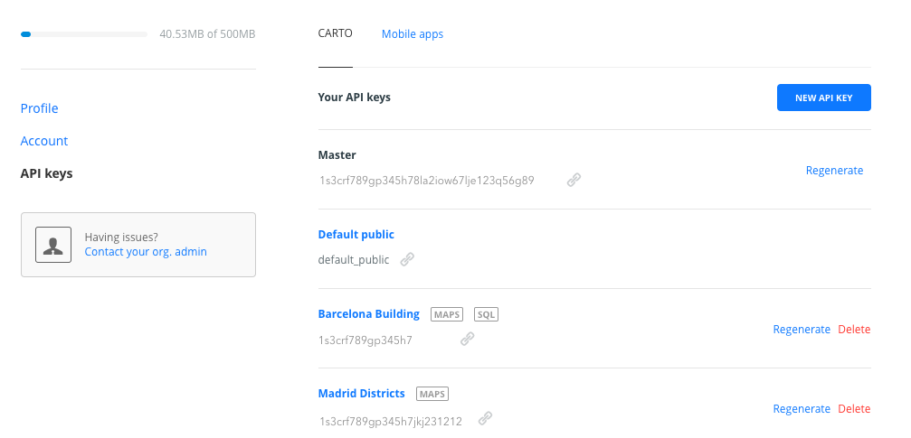
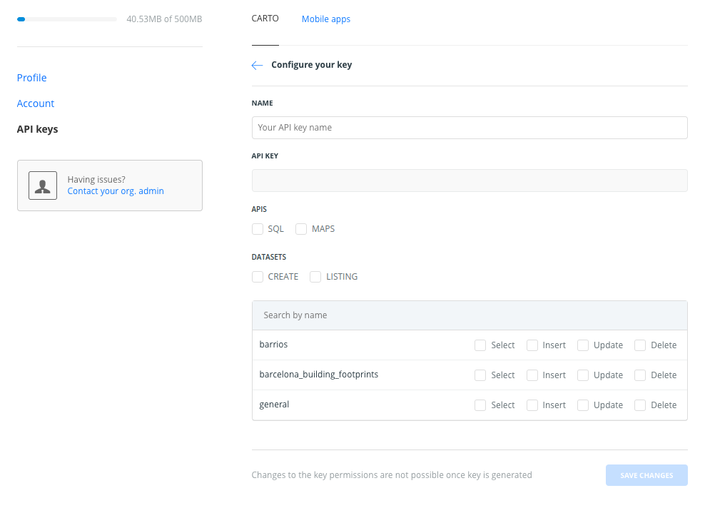

## CARTO Authorization 

All requests to CARTO's APIs (Maps, Sql, etc.) require you to authenticate with an API Key.
API Keys identify your project and provide a powerful and flexible primitive for managing access to CARTO's resources like APIs and Datasets.

These API Keys can be provisioned, revoked and regenerated through the [Auth API]({{site.authapi_docs}}/reference/) or the dashboard. You are able to manage authorization through the UI, by [logging on to your CARTO account](https://carto.com) and managing everything in there. Here you have an example of the authorization dashboard in a real CARTO account.

And here you can see the process of creating a new API key, managing its name and resources in terms of APIs and Datasets, including its permissions.

It requires to add a name and grant permission for at least one of these: 
* SQL API: you will have to include CREATE datasets or specific permissions on any table.
* MAPS API: you will have to specify SELECT permissions on any table.
* CREATE datasets: allows you to create tables in the user schema by using the SQL API, and also modify or delete the tables previously created with it. It won't allow to modify or delete a table created with a different API key, in that case you'll receive an `Access denied` error.
* LISTING datasets: allows to read the metadata from the existing tables, views and materialized views in the user schema by using the endpoint: `api/v4/datasets`

**Warning:** Changes to the key permissions are not possible once key is generated.
