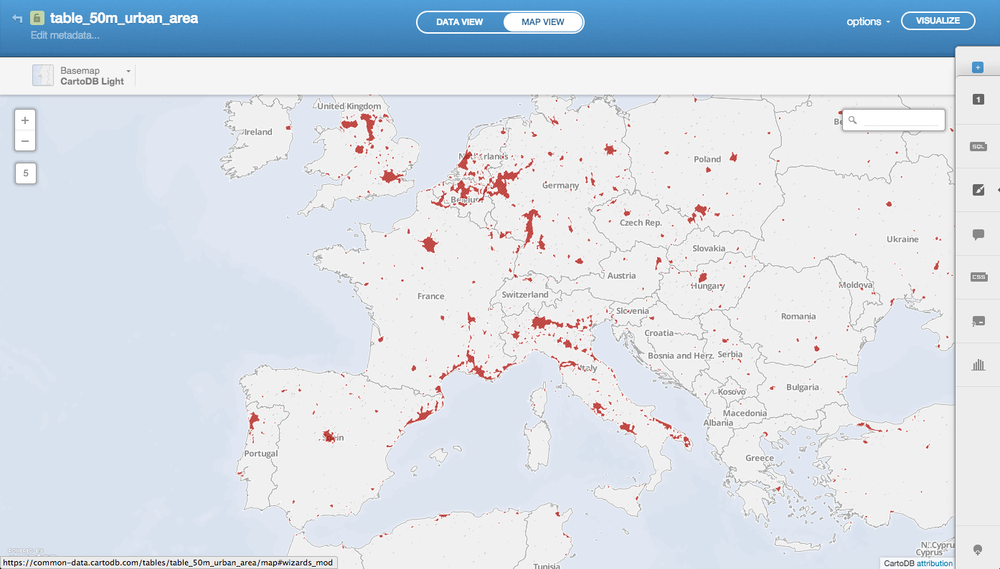
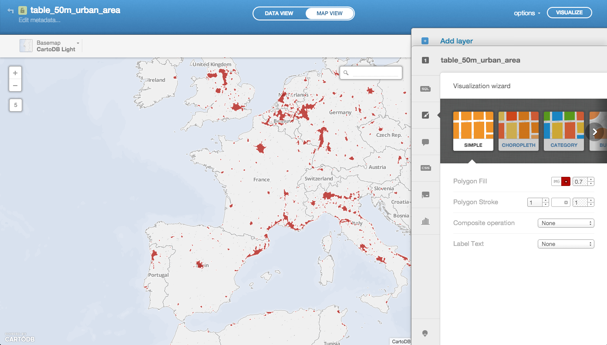
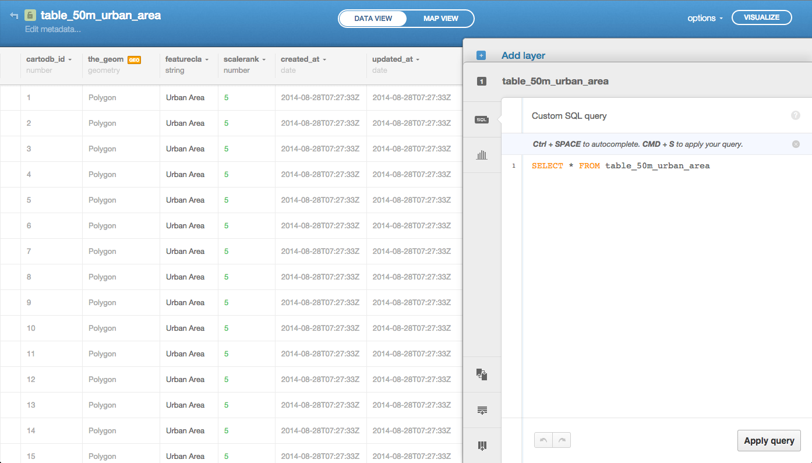

CartoDB introduction
====================

CartoDB is an open source tool that allows for the storage and
visualization of geospatial data on the web.

It was built to make it easier for people to tell their stories by
providing them with flexible and intuitive ways to create maps and design
geospatial applications. CartoDB can be installed on your own server
and we also offer a hosted service at `carto.com <https://carto.com>`_.

If you would like to see some live demos, check out our
`videos <http://vimeo.com/channels/cartodb>`_ on Vimeo.
We hope you like it!

What can I do with CartoDB?
----------------------------

With CartoDB, you can upload your geospatial data (Shapefiles, GeoJSON,
etc) using a web form and then make it public or private.

After it is uploaded, you can visualize it in a table or on a map, search
it using SQL, and apply map styles using CartoCSS. You can even access it
using the CartoDB `API OVERVIEW <https://docs.carto.com/cartodb-platform.html>`_
and `SQL API <https://docs.carto.com/cartodb-platform/sql-api.html>`_, or export it
to a file.

In other words, with CartoDB you can make awesome maps and build
powerful geospatial applications! Definitely check out the `CartoDB
Develop <https://docs.carto.com/>`_ for interactive examples
and code.

