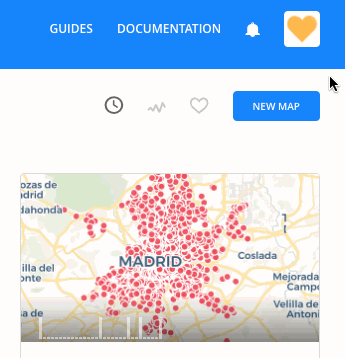

## Authentication

CARTO.js v4 requires using an API Key. From your CARTO dashboard, click _[Your API keys](https://carto.com/login)_ from the avatar drop-down menu to view your uniquely generated API Key for managing data with CARTO Engine.



Learn more about the [basics of authorization]({{site.fundamental_docs}}/authorization/), or dig into the details of [Auth API]({{site.authapi_docs}}/), if you want to know more about this part of CARTO platform.

The examples in this documentation include a placeholder for the API Key. Ensure that you modify any placeholder parameters with your own credentials. You will have to supply your unique API Key to a [`carto.Client`](#cartoclient).

```javascript
var client = new carto.Client({
    apiKey: 'YOUR_API_KEY_HERE',
    username: 'YOUR_USERNAME_HERE'
});
```
